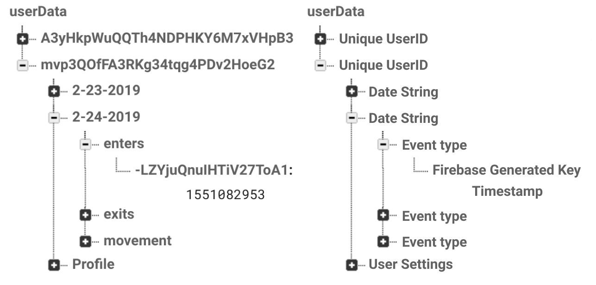

# ENGS 90 Serta Simmons Bedding Children's Sleep Monitoring System Application
## Sponsor: JD Velilla at Serta Simmons
### Code by: Emily Chao & Sheppard Somers
### Design: Emily Chao, Sheppard Somers, and Regina Yan<sup id="fnl1">[1](#fn1)</sup>
### Project members: Cristian Vences, Dan Choe, Emily Chao, Lily Hanig, Rachel Martin, & Sheppard Somers
### Advisor: Professor Geoffrey Luke
Completed Fall 2018 and Winter 2019
The sensor code that this application displays data from was created by Cristian Vences, Dan Choe, and Rachel Martin and is [here](https://github.com/rhmartin/sleep).

# Overview
Mobile interface for parents to learn more about and thereby improve their children's sleeping habits. This application displays our four metrics of time in bed, movement, bed exits, and bed wetting collected by our hardware product. It is part of a feasibility study for Serta Simmmons Bedding (SSB), as such  it features a complete user interface to view the data and logon, but is lacking in its algorithms and notifications. The application will allow the hardware and user experience to be tested as part of product development for SSB. It is currently set up to be run and built as an iOS application.

# Getting Started
Clone the repository and run ```yarn``` to install the packages and dependencies. The application is run using expo, see [expo installation instructions.](https://docs.expo.io/versions/latest/introduction/installation/).

The application can be started by ```running yarn start``` in the sleep directory and then selecting option ```i``` to run in the iOS simulator or scanning the QR code to download the expo mobile application and run the app. Either way the app will have live reloading upon file saves.

## Building a standalone app
The app can be built by changing the version number in ```app.json``` and running ```expo build:ios```. This will yield a link from which the app file can be downloaded.

## Uploading to TestFlight
After building the app, Xcode and the application uploader can be used to add the app to your AppStore Connect account. Full directions are found on [Expo's website here](https://docs.expo.io/versions/latest/distribution/uploading-apps/). They are summarized as:
* Build standalone app file and download it from the resulting url
* Open XCode and click ```XCode --> Developer Tools --> Application Loader```
* Follow instructions in application loader
* Click the file upload button and select the standalone app file
* Upload the application
* Wait to receive confirmation email of upload  
* Move to the TestFlight tab and select builds, you should see your current build
* Fill in compliance information for build on AppStoreConnect. (The app does not currently use encryption).
* Go to or add a user group:
    * Invited internal testers, added via app ID will immediately be able to download the app. Click the group, then builds then the plus to add a build and add the most recent build.
    * For external testers who can be invited via a link, the app will require Beta App Review from Apple which takes about 24hrs and you will receive an email upon completion. To begin Beta App Review, click on the external user group and click add build as with above, then click submit for Beta App Review.
* Users will be notified of new builds by email by default and can download the new or updated version via the external link or through TestFlight.

# Functionality
This application displays the user's information on the four key metrics mentioned above, sleep, enters and exits, bed wetting, and movement, as well as comparisons to national averages* and various user settings. It also allows users to sign in to the application after creating an account. The information is intended to help parents monitor the four metrics to better understand their children's sleeping habits and improve them.

To this end, the app contains four timespan views, a settings view, a sign in view, and a national averages page. In terms of react structure, the app navigates between the homescreen (4 timespan views), settings, sign in, and national averages, as well as a calibration components. The homescreen component has a tab view of the time spans and renders the appropriate component (day/week/month/all screen). Each of these files are described in detail below. The homescreen component carries out all of the data fetching and processing from the database. As per our main recommendations, this processing should be moved to the database so that download amounts are minimized.

## Firebase Database
The Google Firebase realtime database that our app and sensor suite interfaces with is: https://sleepdata-d5465.firebaseio.com/

The database currently contains two concurrent structures. The hierarchy being phased out was structured for a single user and simply contained each night with the timestamps of sleep events under each night. The new hierarchy is under ‘userData’ and contains an object for each user, keyed by the unique user id (UID) created by Firebase authentication. Under each user, the structure mirrors the structure of the old hierarchy. The first level contains dates for each night of measured sleep. Under each date, the second hierarchy contains time-stamped array of sleep events. "enters" contains an array of Epoch timestamps for each bed enter, "exits" contains an array of Epoch timestamps for each bed exit, "movement" contains a string array of Epoch timestamps and corresponding restlessness averages (averages rolled up every threshold number of seconds as determined on the Arduino), and "wets" contains a string array of any bedwetting events. Although the app can handle missing "exits", "movement", and "wets" arrays, a missing or empty "enters" array will cause the night's data to be disregarded.

## Mobile App and Code
The Thayer team has delivered a GitHub repository link to all project code, a mobile app published on Apple TestFlight, administrative access to a Google Firebase database containing test data, and this Go-Forward Plan to SSB. Our app is programmed in React Native, uses Expo, interfaces with Google Firebase, and visualizes graphs with the Formidable Labs Victory Native package. The code is well-commented, but in summary it contains 13 main files:

### ```AllScreen.js```
This file is located in the components folder and is a component of HomeScreen.js. It contains the rendering code for the "All" data view page. In this view, a full data report of sleep is reported in a stacked bar graph showing the number of hours asleep, awake, and napping for each day. By clicking on a bar, the user can switch the daily details displayed under the "Sleep" title. By clicking on those daily details, the user is transported to the daily view, as rendered in "DayScreen.js". Below the sleep graph, line graphs showing data trends are shown for movement, bed exits, and bedwetting. The movement chart graphs the daily movement average, ranked on a scale of 0 to 100. The bed exits graph shows the daily amount of times the user exited the bed each night over time, and the bedwetting graph shows the daily number of bedwets. Finally, averages for each night's sleep duration, movement, bed exits, and bedwetting events is provided for the full data range.

### ```AveragesScreen.js```
This file is located in the components folder. It contains the rendering code for the national averages comparison, accessible by the white graph button on the right header of the app. Bar graphs showing the child's all-time averages compared to the national averages for their age demographic are shown for sleep duration, movement, nightly bed exits, and nightly bedwetting events. On the sleep duration chart, a line showing the recommended hours of sleep for the child is also drawn. Currently, the national averages and recommended sleep duration are hard-coded in. Moving forward, SSB should calculate these national averages from the data of all their users and consult with sleep doctors to determine the recommended sleep for each unique child.

### ```CalibrateScreen.js```
This file is located in the components folder. It is navigated to through the "Calibrate Tracker" button on the Settings page. This page displays instructions, a  calibrate button, and will provide confirmation when calibration is completed. The process is: a child should sit on the edge of the bed and press the calibrate button. This writes a "1" to the ‘Profile/calibrate’ variable in the Firebase database. When this equals 1, the sensor suite records the load cell readings over ~10 seconds to create a reference of how much the child and mattress weigh. After saving this reading, the sensor suite sets the calibrate variable to 2 in the database signifying completion. Anytime the variable is 0, the app will prompt the user to calibrate the device.

### ```colors.js```
This file is located under the components folder. It contains the color variables for all app graphics. It is used to facilitate changing colors on the style sheet and Victory Graphs. The graphs cannot receive a style component from the stylesheet so colors are hardcoded into each graph, the color object is used to keep these in one easy to edit place.

### ```DayScreen.js```
This file is located under the components folder and is a component of HomeScreen.js. It contains the rendering code for the "Day" data view page. Before rendering the graphics, the file computes two arrays for the sleep graph, ySleep and in_out. ySleep contains the timestamps of each enter or exit for the night. in_out contains a 0 if the user left the bed at the corresponding time in ySleep, or a 1 if the user entered the bed at the time. Both of these arrays are pushed to sleepData in order to be viewed graphically. In terms of graphics, the page renders a sleep graph displaying the total duration of sleep along with sleep times. Times where the user was in bed asleep are shaded blue, and times whee the user was out of bed or not asleep are not shaded. Underneath, a line graph showing all movement readings over the night is drawn along with a movement average on a 0-100 scale. The number and times of bedwets and bed exits are also included.

### ```HomeScreen.js```
This file is located under the components folder. It contains the main processing and navigation code for our app. It also is the main file interfacing with the Google Firebase database. There are three main functions. The first, toggleTutorial() allows the user to turn tutorial mode on and off by pressing the white i button on the left header. When tutorial is toggled on, white text appears on each screen walking the user through the different app functions. The second, toggleABtest(), allows the user to toggle between sleep graphs on the "Week" and "Month" views by pressing the views button on the left header. The default view shows a graph of the sleep durations for each night. The second view shows a sleep graph with timestamped bedtimes and waketimes for each night. The final and most important function, fetchData(), references the onFetchData variable.

This variable is a snapshot of the Firebase database. First, the function scans through the Firebase hierarchy, only reading sleep data from objects labeled as dates in string form "m-d-yyyy". It reformats the string data as a date object, and fills in empty data for days that are missing from the database. Next, it maps the enters, exits, wets, and movement arrays from the database into corresponding arrays in React Native. In the middle of our project, we encountered an error with sending timestamps in 10 digit vs 13 digit Epoch time. To catch this error, we append three 0s to all 10 digit timestamps that are read in. Effectively, this is setting the milliseconds of the timestamp to 0 if they do not already exist.

For our data cleaning, we check that enters and exits exist, and that there are the correct number of corresponding enters and exits. If not enough enters exist, we fill a fake enter halfway between the two consecutive exits. If not enough exits exist, we fill a fake exit halfway between the two consecutive enters. If the child is still in bed, we display their sleep data through the current time. We calculate sleep times and durations by looking at the difference between consecutive exits and enters. If the time difference is greater than a hard-coded "asleepThreshold", and if the average restlessness in the five minutes after entering bed is lower than a hard-coded "restlessThresh", we consider the user asleep. If the sleep period is less than four hours in length and between the hours of 10 am and 6 pm, we categorize the sleep as napping. Awake, asleep, and napping times and durations are used in our data visualizations in other components.

All data for each night is pushed to the nightData array and eventually saved in state as boards. Each board contains the day (string date from Firebase), dateLabel (mm-dd string date), exited (array of exit timestamps), enters (array of enter timestamps), bedwet (array of bedwet timestamps), sleep (number of hours of sleep for the night), restTime (array of timestamps corresponding to each restNum), restNum (array of restlessness averages throughout the night), inBed (total time in bed from first enter to last exit), dayLabel (label associated with the day of the week Sun-Sat), awake (total time between first enter and last exit where the child is awake), naps (total time napping), restlessAvg (average restlessness per night).

In addition to boards, other state data includes displayBoards (only the boards displayed by the Week component), monthBoards (only the boards displayed by the month component), dateDic (a dictionary of all dates from Firebase), picked (an index showing which board is being displayed by the day component), firstRun (a variable used in setting our default views upon opening the app), and isLoading (a boolean to render graphics after data is loaded).

We also calculate averages, convert timestamps to readable formats, allow the user to scan through days/weeks/months, and execute other functionality in the file. At the end of the file, we set up the functionality to toggle between day, week, month, and all data views.

Homescreen also checks the calibration status, prompting the user to calibrate when ```[UID]/Profile/calibrate: 0.```


### ```MonthScreen.js```
This file is located under the components folder and is a component of HomeScreen.js. It contains the rendering code for the "Month" data view page. Before rendering the graphics, the file sets up offsetData, the array containing information for the second toggleable view of the sleep graph. This array contains information about bedtimes, waketimes, and labels for the second toggleable graph.

Depending on the view toggle state, the file first draws a bar chart showing either total sleep duration for each night or the bedtimes/waketimes for each night. Like in AllScreen.js, clicking on bars and bar details allows the user to view daily sleep details or the day page. Underneath the sleep chart, monthly averages for sleep duration, movement, bedwets per night, and bed exits per night are displayed.

### PairDevice.js
This file collects the unique device id (DUID) and adds the signed in user’s UID to the database under ./Pairing/[DUID]/UID: [UID]. The file confirms this pairing when ./userData/[UID]/Profile/hasD is set to true. The page displays a confirmation screen with multiple options, but the alert from homescreen regarding calibration will trigger on top of this page. This is a bug that should be worked out to allow the user to proceed to calibration if they choose.

### ```SettingsScreen.js```
This file is located under the components folder. It contains the rendering code for the settings page and is accessible by clicking the settings gear on the left header. Currently, the settings screen displays the current user, allows the parent to calibrate their tracker, and enables customizable notification settings for various sleep events. At the bottom of the page, a "Save Settings" button allows the user to change their notification preferences stored in the Firebase database. "Log out" allows them to log out of their account. Going forward, the notification settings saved in Firebase should be used to customize when notifications are sent to the user. A privacy agreement, child details screen, and method of adding children to the parent's account should also be implemented.

### ```SignIn.js```
This file is located under the components folder. It contains the logic and rendering code for the sign-in page and multiple user functionality. User accounts are username and password protected in order to address privacy concerns. Passwords might have to be encrypted, unclear if this happens automatically with Firebase's authentication function.

### ```style.js```
This file is located under the components folder. It contains the different style variables used throughout the app.

### ```WeekScreen.js```
This file is located under the components folder and is a component of HomeScreen.js. It contains the rendering code for the "Week" data view page. Before rendering the graphics, the file computes an offsetData array similar to that in month which contains the processed data for the second toggleable view of the sleep graph. In terms of graphics, this file renders a graph showing either sleep duration or bedtimes/waketimes for each night of the week. Below, it displays weekly averages for sleep duration, movement, bedwets per night, and bed exits per night.

### ```App.js```
This file contains the root stack for our app. It also sets up the beginning notification-handling structure. Currently, the app prompts users to register for push notifications with Expo. Using Expo's test push notification server, the developers can manually send notifications to specific users. However, this functionality has not been fully built out with the app on Apple TestFlight. In addition, we have not programmed any back-end logic for sending user notifications or referring to user notification preferences.

### ```Firebase.js```
This file contains the Firebase database connection information for our app. By changing this file, SSB can change which database the app interfaces with. All configuration ID details are easily found on Firebase.

# Recommended Improvements
Moving forward, we recommend that Serta Simmons make several changes to the logic of our sleep algorithms and app, data visualization, and database structure. At the highest level we have generally implemented the front-end, but have not created any logic on the server side. This is the most pressing addition. The server should include logic for better processing data from the arduino and serve specific data to the app rather than all at once.
## Database:
### Current Structure
The current database contains the following hierarchy:


The database contains no functions, is not cost optimized (does not minimize download), cannot send notifications, and is only partially password protected.
### Read/Write
**Current:** Direct write and read by the hardware and app, app pull all of the users data every time
**Recommendation Short Term:** Downloads must be minimized to minimize cost, the current set up is projected to cost **~$50/user/yr** while an optimized database may only cost **$4.20**, see cost projections below. This optimization likely requires setting up functions for pull requests (likely via HTTP) that only send the most recent day, store old data locally on the device. Data appears to be around 0.35 MB/day so this should not be a burden to the device while downloads have averaged around 150 MB/day, see cost projections below. This will likely require saving days as ```Date Object``` keys instead of ```strings``` so that the days can be sorted easily. It may also require saving the most recent day downloaded in the application.
* If local storage is not desired, data should only be pulled as it is accessed (ie. only pull all data if the user clicks on the "All" view)
* See this article as a warning of what can happen: [Lessons Learnt the Hard Way Using Firebase Realtime Database](https://pamartinezandres.com/lessons-learnt-the-hard-way-using-firebase-realtime-database-c609b52b9afb)

**Recommendation Long Term:** Ultimately another database may be more economical, especially if optimization is not completed

### Cost Projections
Firebase charges for the number of GB stored as well as the number of downloads. Downloads are currently very high as discussed above, which drives almost all of the costs.		
 The formula is the sum of the cost of storing data as it accrues and the average downloads per month.

	cost per user per yr = (stored MB/mo.)\*(sum(1-12))\*($0.005/MB) + (downloads MB/mo.)\*($0.001/MB)

  | Data Structure | Data/mo. (MB) | Downloads/mo. (MB) | Cost ($/yr) |
|----------------|---------------|--------------------|-------------|
| Current        | 9.9           | 4590               | 59.10       |
| Optimized      | 9.9           | 24.9               | 4.20        |

The projected costs/user estimations of using the Firebase database with the current app and the potential cost for a download optimized application.

### Security
**Current:** Read/write rules in firebase are set according to the firebase docs to only allow authorized users to access data under their UID. It does not. The front end requires authentication but the backend can still read and write without authentication.

**Recommendation:** Check rules, test protection, write new rules, seek other authentication or database options.

The database also still contains our old data that is not sorted under a userID. This has not been deleted as it may be of use in displaying example data if sign in is disabled or as example to an unregistered user.

### General
**Timestamps:** Finalize as 10 or 13 digits (with or without milliseconds in Epoch time) and adjust app logic accordingly. Currently is 10 for events and 13 for movements

## Logic/Algorithms
### Improve Sleep Algorithm
**Current:** the app in ```HomeScreen.js``` in ```onFetchData()``` executes a simple algorithm that checks that the child's time in bed is greater than a threshold amount, and that the child's restlessness in the five minutes after the "asleep" period begins is less than a 30 out of 100

**Current:** the napping algorithm (also in ```onFetchData()```) categorizes any "asleep" period as a nap if it is less than 4 hours in duration and between the hours of 10 am and 6 pm

**Recommendation:** Further testing into thresholds or rewrite algorithm completely after larger scale data collection and possibly apply machine learning after testing with a sleep lab or other definitive method. From our experience, machine learning algorithms such as decision trees, regressions, naive Bayes, nearest neighbor, support vector machines, and deep neural networks may be useful.
* After categorizing awake v asleep, identify as normal sleep, restless sleep, or nap.
* Do not report light/deep/REM sleep as this is too complex to be useful for parents and can be misleading (according to DHMC sleep doctor)

### Multiple Children
**Current:** Setting include button to add child but no backend.
Recommendation: Add a page for parents to input their child's information and add a second tracker to their account
**Related:** navigation between children, database structure for support
### National Averages
**Current:** Hard-coded in national averages (only the average hrs of sleep is accurate), opt in/out settings (front end and database)

**Recommendation:** Once SSB has gathered enough data or can access data from existing customers, calculate these averages and split based off of age group demographics
### Multiple Users
**Current:** The app and database support multiple users using Firebase’s email & password method, user data stored under UID (unique user id - automatically generated by Firebase), and read/write rules specified in the database to restrict to authorized and matching users

**Issue:** The hardware is able to write to the database without signing in if it has the UID hard coded in, meaning the Firebase rules are not effective. Again, the rules do deny read permission from the app side if not signed in, so this seems to impact writing from the arduino but not reading from the react native application.

**Recommendation:** Implement other sign on methods, server logic for creating initial user branch of database via the server not the app
### Data Processing/Usage:
**Current:** The app downloads the entire database, processes it from the JSON object of strings into js arrays, analyzes data with algorithms described above. The app then stores multiple arrays in state including every day of data and splits of data for each view. This creates some lag in the application and extraordinarily high download amounts (See section below on Database improvements)

**Recommendation:** Store more useful data in the database, possibly performing all logic on the database and only sending data to be directly used in graphs and data summaries, fetch only relevant data rather than always the whole history, store less movement/restlessness data

## UI
### Tutorial
**Current:** The ```i``` button toggles explanatory/tutorial style text on views, user can read to walk through app functionality, each title also is clickable to bring up an alert about what the metric is. Initial introductory feature video and walk through are linked here

**Recommendation:** Add interactive introductory tutorial walk-through for the first time the user opens the app
### Customize Metric Displays
**Current:** Displays the same metrics regardless of preference, except for main week and month graphs which can be toggled from total hours broken down by awake/asleep/napping and time into and out of bed. Displays trends of data on Month page, details on day page.

**Recommendation:** Allow parents to customize the data metrics shown on the summary page, e.g. show bedwet or don’t, and/or include more averages such as average bedtime or waking time
### National Averages/Recommendations
**Current:** Hardcoded, fake national averages, with recommended line for sleep amount
**Recommendation:** Add recommendations specific to their child about how much sleep to get, how many exits/wets are normal each night, how restless their child should be
* Consult with medical professionals and/or determine "normals" based off testing results
* Clarify movement (on a 0-100 scale) by telling parents what a goal range should be, e.g. Are most children of the same demographic scoring a 30-40? 80?

### Movement Presentation
**Current:** Line graph from low to high of movement. This scale is from 0-100.
**Recommendation:** Clarify range, include some sort of baseline. We tested:
* Averages on the scale of 0-1, 0-10, and 0-100, but the range seems to make no difference in user confusion
* The descriptions (low, normal, high) also confuse people, without them people are even more confused
* We suggest dedicating a portion of the tutorial to explain to users what the movement metrics mean

### Clicking Bar Chart
**Current:** Click on bar to update button above graph to show summary of that day, click button to go to day detail

**Recommendation:** Pop up a little, hovering box detailing important sleep details for that day
* By clicking on that box, parents could then navigate to the daily view
* This will clean up the user interface and make it more intuitive

### General Layout
**Current:** Flat, little busy, no delimitation between sections, see screenshots above

**Recommendation:** Align visual layout more closely with existing SSB sleep tracking apps, slight background shading behind graph to give depth/section it off or possibly borders between sections to visually break up and compartmentalize the main views


# Sources and Resources Consulted
This application was began using the [React Native Firebase Tutorial: Build CRUD Firestore App](https://www.djamware.com/post/5bbcd38080aca7466989441b/react-native-firebase-tutorial-build-crud-firestore-app) tutorial as well as the [expo tutorial](https://docs.expo.io/versions/latest/workflow/up-and-running/) and [documentation](https://docs.expo.io/versions/v32.0.0/introduction/) and the [React Native Documentation](https://facebook.github.io/react-native/).

Throughout development, the resources listed above were heavily relied upon. Portions of the code are taken rather directly from the documentation of these main technologies uses (React Native, Expo, and Firebase). Naturally, stack overflow and other general resources were used to answer specific questions throughout development. Most of these inquiries were very generic and/or basic and are not explicitly cited as it either came from the provided documentation or tutorial of the language/framework/dev tech/database or was a commonly known piece of code that could easily be expected to be known by someone familiar with the field.

 We have much gratitude for the significant design assistance  provided by Regina Yan, check out [her portfolio](http://reginayan.me/index.html). As discussed in the ENGS 90 Final Design Report, the development was also user driver and thanks is extended to those 60 user testers who have helped define the user experience and interface.

 <a id="fn1">1</a>: Emily and Sheppard developed the UI through user testing but significant design refinements were suggested by Regina Yan. She was consulted as a UI expert as the lead designer at Dali. [↩](#fnl1)
